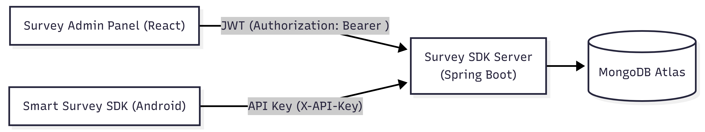

# 🧠 Survey SDK Server

A Spring Boot backend for the **Smart Survey SDK** and the **Survey Admin Panel**.

This server is responsible for:
- Developer authentication (JWT) for the Admin Panel
- API Key authentication for the Android SDK
- Survey CRUD operations - Survey CRUD operations (create / read / update / delete)
- Collecting and storing survey responses from end-users

🌐 Live Server (Render): **https://survey-sdk-server.onrender.com**

---

## 🏗️ Architecture

High-level flow:

- **Admin Panel (React)** → calls **Admin API** using **JWT (Bearer token)**
- **Android SDK** → calls **SDK API** using **API Key** header: `X-API-Key`
- **Server** → stores data in **MongoDB Atlas (cloud)**



Project layers (typical request path):

- **Controllers** (REST endpoints)
- **Services** (business logic)
- **Repositories** (MongoDB access)
- **Converters / DTOs** (mapping entities ↔ DTOs)

---

## 🗄️ Database

- **MongoDB Atlas (Cloud)**
- Spring Data MongoDB repositories (`MongoRepository`)
- The MongoDB connection string is provided via environment variable:

```properties
spring.mongodb.uri=${MONGODB_URI}
```

---

## 🛠️ Tech Stack

- **Java 17**
- **Spring Boot 4.0.1**
- **Spring Web MVC**
- **Spring Data MongoDB**
- **JWT (jjwt)**
- **BCrypt (jbcrypt)**
- **OpenAPI / Swagger UI** (springdoc)

---

## 🚀 Getting Started (Local)

### 1) Clone the repository
```bash
git clone https://github.com/Tomerlevy104/survey-sdk-server.git
cd survey-sdk-server
```

### 2) Set environment variables

You must provide a MongoDB Atlas connection string:

```bash
export MONGODB_URI="YOUR_MONGODB_ATLAS_URI"
```

(Optional) set a custom port (default is 8080):
```bash
export PORT=8080
```

On Windows PowerShell:
```powershell
$env:MONGODB_URI="YOUR_MONGODB_ATLAS_URI"
$env:PORT="8080"
```

### 3) Run the server

Using Maven:
```bash
mvn spring-boot:run
```

Or build + run:
```bash
mvn clean package
java -jar target/*.jar
```

Server default URL:
- `http://localhost:8080`

---

## 🔐 Authentication

### Admin Panel authentication (JWT)
- Login returns a JWT token.
- Admin Panel sends the token on each request:

```
Authorization: Bearer <JWT>
```

### SDK authentication (API Key)
- The Android SDK sends an API key on each request:

```
X-API-Key: <YOUR_API_KEY>
```

- The server matches the API key to the correct developer and injects `developerId` into the request context.

---

## 🧩 API Endpoints

### ✅ Auth (for Admin Panel)
| Method | Path | Description |
|---|---|---|
| POST | `/api/auth/register` | Register a new developer and generate an API Key |
| POST | `/api/auth/login` | Login and get a JWT token |

---

### 🧑‍💼 Admin Panel API (JWT required)
Header:
- `Authorization: Bearer <JWT>`

| Method | Path | Description |
|---|---|---|
| GET | `/api/admin/surveys` | Get all surveys for the logged-in developer |
| GET | `/api/admin/surveys/{id}` | Get a single survey by ID (developer-owned) |
| POST | `/api/admin/surveys` | Create a new survey |
| PUT | `/api/admin/surveys/{id}` | Update an existing survey |
| DELETE | `/api/admin/surveys/{id}` | Delete a survey |
| GET | `/api/admin/surveys/{surveyId}/responses` | Get all responses for a specific survey |

---

### 📱 SDK API (API Key required)
Header:
- `X-API-Key: <YOUR_API_KEY>`

| Method | Path | Description |
|---|---|---|
| GET | `/api/sdk/surveys/{id}` | Get a survey by ID |
| GET | `/api/sdk/surveys/random` | Get a random survey |
| POST | `/api/sdk/survey-responses` | Submit a survey response |

---

## 🌍 CORS

CORS is configured to allow the Admin Panel and local development server to access the backend.

Allowed origins:
- `https://survey-admin-panel.onrender.com`
- `http://localhost:3000`

---

## 📄 API Documentation (Swagger / OpenAPI)

When the server is running, you can use Swagger UI to explore and test endpoints:

- `http://localhost:8080/swagger-ui/index.html`
- (Render) `https://survey-sdk-server.onrender.com/swagger-ui/index.html`

---
## 📚 Documentation

Full documentation is available here:  
👉 https://tomerlevy104.github.io/smart-survey-sdk/

---
## 👨‍💻 Author

Developed by **Tomer Levy**
